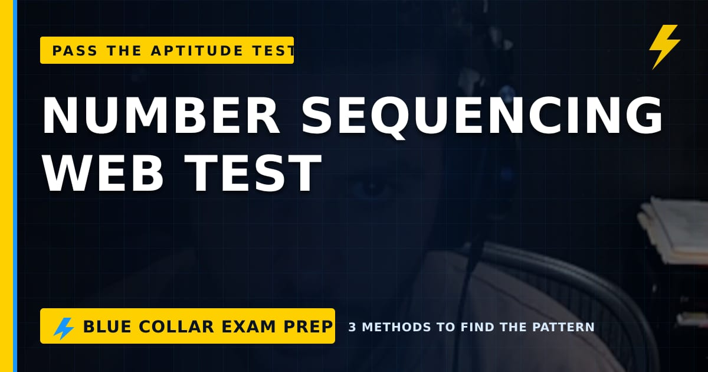

# BCEP Content Studio

BCEP Content Studio is a Windows desktop application for turning OBS lesson
recordings into website-ready content for Blue Collar Exam Prep.

It provides a focused workflow for:

- Selecting a frame from an OBS recording.
- Creating a branded 1200 × 630 feature image.
- Turning a supplied transcript into an editable Markdown article with Codex.
- Previewing and saving generated content locally.

The interface supports desktop, portrait, and Windows split-screen layouts.



## Current status

This project is an early MVP. It creates media and article drafts locally; it
does not automatically publish, upload, or delete website content.

Generated content should be reviewed before publication.

## Requirements

- Windows 10 or Windows 11
- [Node.js LTS](https://nodejs.org/)
- [Codex CLI](https://developers.openai.com/codex/cli/) and a signed-in account
  for article generation

FFmpeg and FFprobe are included through the project's npm dependencies.

## Quick start

Clone the repository and run:

```powershell
npm install
npm start
```

On Windows, you can also double-click `install-and-run.bat`.

If Codex is not yet configured:

```powershell
codex login
```

## Development

```powershell
npm start
npm test
npm run build
```

To create the Windows installer and portable executable:

```powershell
npm run dist:win
```

Build artifacts are written to `release/` and are intentionally excluded from
version control.

## Project structure

```text
src/main/              Electron main process and local services
src/renderer/          Application interface and responsive styles
src/preload.js         Narrow bridge between Electron and the interface
scripts/               Renderer and Windows build helpers
test/                  Automated service tests
examples/              Example generated output
assets/ and build/     Application artwork and icons
```

## Privacy and security

- Videos, transcripts, drafts, and generated output should remain local and
  are excluded from Git through `.gitignore`.
- The renderer uses Electron context isolation and does not receive Node.js
  access.
- Article generation sends the text supplied to the locally installed Codex
  CLI. Review OpenAI's applicable data controls before processing sensitive
  material.
- Never commit `.env` files, credentials, API keys, private keys, recordings,
  transcripts, or generated drafts.

If a secret was committed previously, adding it to `.gitignore` is not enough:
rotate the secret and remove it from the repository history.

## Testing

The automated tests cover feature-image output settings, safe filenames,
headline wrapping, and article-prompt behavior:

```powershell
npm test
```

## License

Copyright © Blue Collar Exam Prep. No open-source license is currently
provided. Unless a license is added, the source remains all rights reserved.
